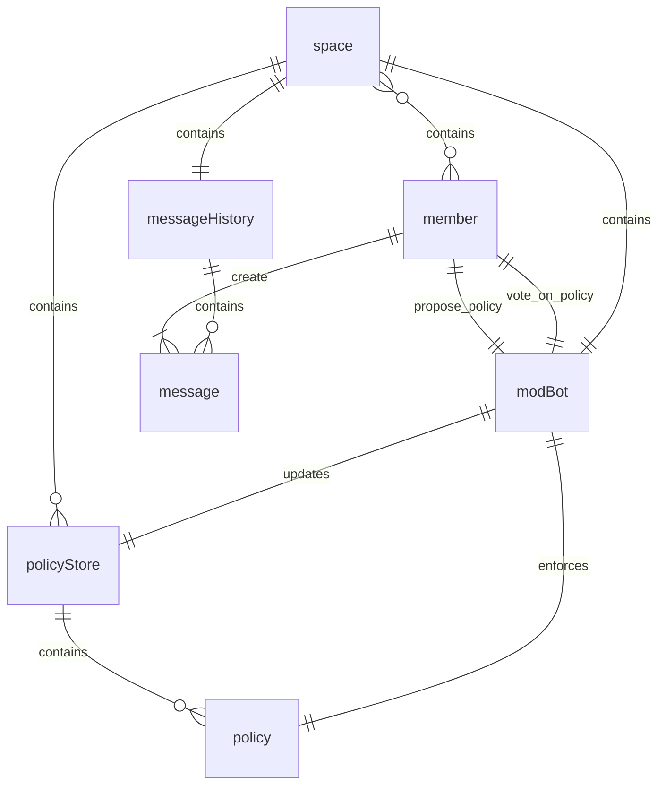
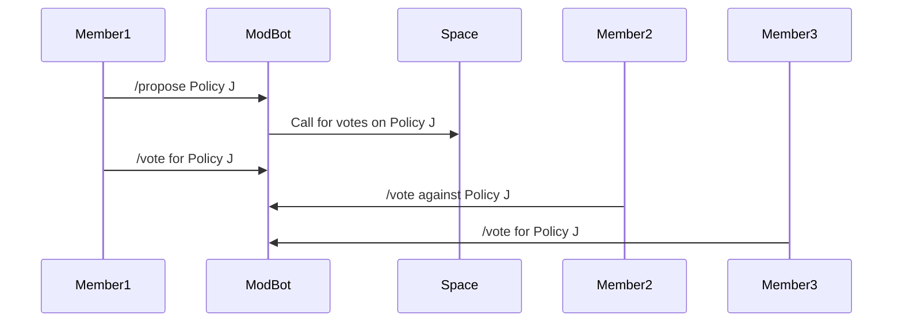
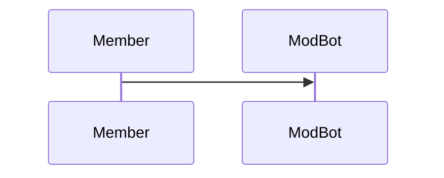

## Intent
Enable determination of moderation policies in a social setting by members of a community through natural language and enforced via interpretation through a moderation bot that can interpret natural language. 
## Motivation
Consider a semipublic space consisting of members, moderation policies, and a history of messages in that space. 
- moderation policies are sometimes determined by specific members designated as administrators of a space (sometimes called moderators).
- administrators are responsible for making decisions about what messages fit within moderation policies, and taking action based on those policies (such as to remove a member from the community).
- interpretation of moderation policies by an elevated member of that community can lead to subjective interpretation influenced by conflicting interests.
- ER diagram of moderation with admins?
## Applicability
_Describe the situations or contexts in which the design pattern can be applied._
- semipublic digital spaces because of the need for a clear notion of who is a member
- a durable community where members have "skin in the game" (*more technical description here*)
## Structure
_Include a UML diagram or other visual representation of the pattern’s structure._
- entity relationship diagram

## Participants
_Describe the roles and responsibilities of the main components or classes involved in the pattern._ - **Component/Class Name**: _Role and responsibility._
- **Space**: 
- **Policy**: A natural language description of a criteria for allowed messages and resulting actions if that policy is violated.
- **Member**: A representation of a person interacting with a `Space`
- **ModBot**: A service that can interact with `members`, `policies`, and `messages` to determine and enforce policies 
- **PolicyStore** (*is this an implementation not a participant?*)
- **Message**: A text string that is created by a `member` and validated by a `modBot`
- **MessageHistory** (*is this an implementation not a participant?*)
## Collaborations
_Explain how the participants interact with one another._
- sequence diagram of policy selection

- sequence diagram for listing policies

- sequence diagram of policy application
```mermaid
sequenceDiagram
  Member->>Space
```
## Consequences
_Discuss the results, side effects, and trade-offs of applying the pattern._
## Implementation
_Provide guidelines or instructions on how to implement the pattern, including code examples if applicable._
Described is the intended architecture for a planned reference implementation.
## Sample Code
_Provide a full example that demonstrates how the pattern can be implemented in a practical scenario._
## Known Uses
_List real-world examples where this design pattern has been applied._
To date, there are no known examples of this pattern being applied. The intent of this pattern document is to motivate it's implementation.  Hopefully this section can be updated over time as this pattern is explored further in practical applications.
## Related Patterns
_Mention other design patterns that are similar to this one or that are often used in conjunction with it._
- AI First pass, Human Final Moderation (*need better name for this*)
- What would you call the pattern(s) associated with PolicyKit 

## *Variations* (this is not in the og template for design patterns, not sure if I want to leave this in, these might indicate other Related Patterns)
- control whether a message is added to the history based on policies
- different types of voting systems (is there a way to make this pattern independent of voting systems? maybe using something like PolicyKit policies?)
- private/public policyStore?
- ability to ask the bot directly if a comment is ok (pre-check)
- ability to wait for a message to be flagged by the community before it is reviewed by the bot
## *Todos*
- [ ] make sure all diagrams have meaningful titles (and descriptions?)
## *Outstanding Questions*
- better name for `Space` component? `Room`? `Channel`?
- should members belong to a memberlist? then they would be added removed to the list in the case of joins/kicks?
- is there a need for a bannedUsers list for banning?
- check all the relationships, it may be that because I created aggregates such as `policyStore` that it's confusing, but does the `modBot` update `policy` or `policyStore`
	- maybe the `policyStore` is an implementation not a component
- Can this whole pattern be split apart into multiple useful patterns? Such as 1 for voting mechanism and 1 for enforcement? 
- Is `Policy` to general of a term? In this pattern they are explicitly moderation policies. Can this pattern be generalized to policies in general?
- should `Policies` be created by a `member` with a status of whether or not they are approved?