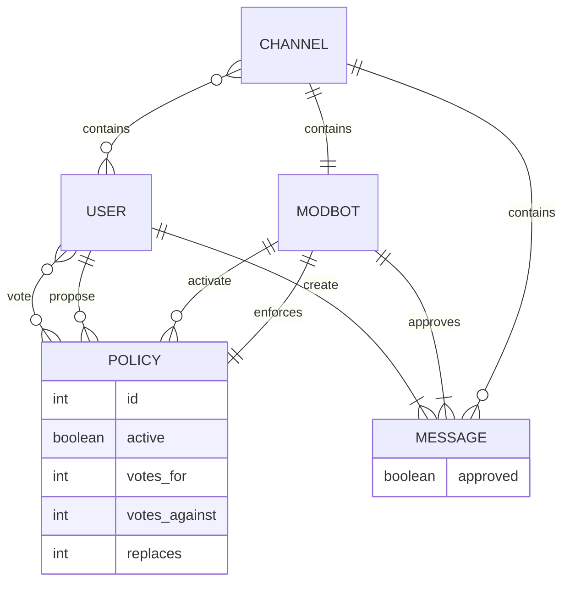
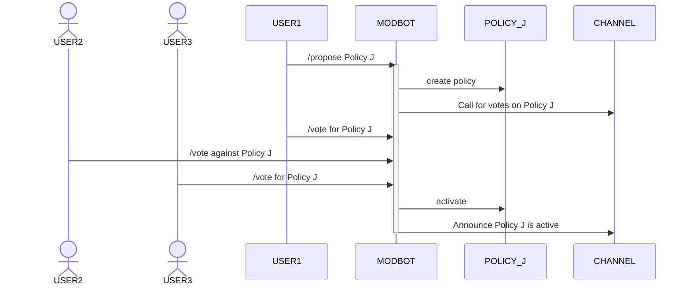
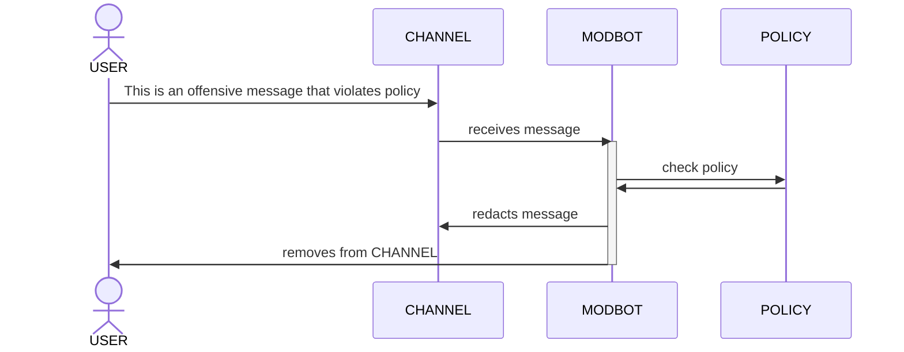
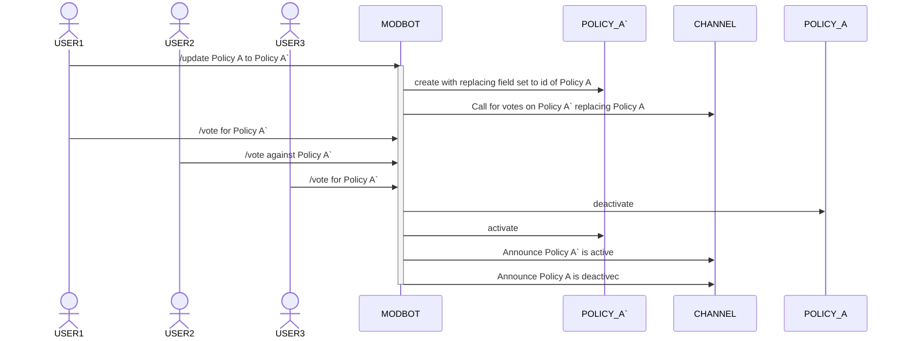

## Intent
Enable collective determination and evolution of natural language moderation policies with enforcement carried out by a moderation bot.

## Motivation
Consider a digital space (channel) consisting of users, moderation policies, and messages. In many such digital spaces, channel policies are set by the Moderators, who are individuals given that status either by Administrators or other Moderators. Moderators are then responsible for interpretation and enforcement of those policies. This can lead to moderator's subjective interpretation of policies influencing the community's identity and path, decreasing agency for the community as a whole. 

A digital space that aims to maintain community agency in regards to self-definition of policies must meet the following criteria:
- Policies are determined by the community as a whole
- Policy enforcement must be consistent
- Policy enforcement must be independent of who is enforcing that policy.

Democratic processes (ie. voting) are known methods for achieving the first criteria and are the method adopted by this design pattern. This could be majority voting, rank choice voting, quadratic voting, or any other voting system that can be clearly understood by community members. For the purpose of this design pattern, examples will use majority voting for simplicity, but that is not meant to be a defining attribute of this pattern and should be determined outside of this pattern and serve as context under which this pattern is implemented.

Achieving independent interpretation and enforcement of policies requires that the entity doing the interpretation and enforcement of policies is not a member of that community.

Achieving consistent interpretation and enforcement requires a lack of variable internal state of the deciding entity. This is impossible to achieve if the entity is a human. Therefore, let us consider the entity interpreting and enforcing policies to be algorithmic. At the time of this writing, a strong option for this might be an artificial intelligence bot that can receive messages, look up or otherwise utilize current policies, and return a decision about any resulting actions to be taken (ex. redact the message, kick/ban a user, etc.). 

From here on let the moderating entity be called the Moderation Bot (`ModBot`).

Of note, no interpretation of an ambiguous policy will be objective. Even using algorithmic decision making will lead to the use of additional information influencing results. Whether this information takes form as implementation details of the algorithm, information absorbed through a training process, or through another means, the algorithm must resolve ambiguities in order to complete the action of making a decision.

While subjectivity can not be avoided in the presence of ambiguous policies if a decision is to be reached, often ambiguities are only discovered over time as communities face new challenges that are unspecifically addressed by current policies. Additionally, it may be determined that upon witnessing the result of implementing certain policies, those policies had unintended consequences leading to decisions going against the will of the community such as overly restrictive policies that limit the ability of the group to self-express.

In order to adapt to community learnings about the gap between current policies and their intended state, members need the ability to propose replacing a current policy with an updated version. This update can be voted on, at which point the moderation bot can deactivate the old policy and activate the new policy.

## Applicability
Use the Evolution Collective Moderation pattern when:
- a digital space has clear membership. `Users` must be know to be real to avoid voter fraud and manipulation.
- a digital space is small to medium sized (< 50 active users). Due to the coordination cost of discussing policies in a way leading to inclusion of all voices, this pattern should not be applied to large groups, where subgroups can dominate the conversation and thus the eventual decision surrounding a policy. 

## Structure

## Participants
- **Channel** (also referred to as a Digital Space)
    - represents a shared digital space (such as a chat room) which is the context for `Messages` to be posted and read by `Users`. 
- **Policy**
    -  defines a natural language criteria for allowed messages and resulting actions if that criteria is violated. In addition this object stores the votes for and against as voted on by users, as well as whether the policy is currently active, with the values themselves likely updated by the Moderation Bot (although this is an implementation detail that must be determined in context).
- **User**
    - represents a person interacting with a `Channel`
- **Moderation Bot** (ModBot)
    - A service that can interact with a `Channel` to determine and enforce policies 
- **Message**
    - A text string that is created by a `users` and validated by a `ModBot`
    - A message can also be an instruction to the `ModBot` to propose, replace, or deactivate a policy

## Collaborations
### Policy Selection

The following shows the sequence of events surround a proposal of a new policy, and its successfully being voted into active status:

### Policy Application

Assuming an active `Policy` that forbids "offensive" `Messages` and requires that both the `Message` be redacted and the `User` removed from the `Channel`:

### Updating a Policy

The following shows the sequence of events surrounding a user requesting an active `Policy` (`Policy A`) be updated to `` Policy A` ``:

## Consequences
Some of the benefits and liabilities of the Evolutionary Collective Moderation pattern are:
1. *No reliance on a person (user) for policy enforcement.* Relying on a person (user) to enforce policy creates several problems that are avoided here. Specifically avoided are the influence of an individual `User`'s (the mod's) personal biases and self-interest both when determining policies and when choosing how to apply them.
2. *Collective determination of accepted policies.* All users that are members of a channel have the ability to contribute to determining the acceptance of proposed policies as well as to propose policies themselves.
3. *Limited to ability of ModBot to interpret and enforce policies.* The `ModBot` must understand what action is being called for within a policy and have the ability to execute that action. Without further guardrails, it is possible to write a policy that can not be acted upon.
4. *Ambiguous policies lead to influence of algorithmic bias.* Because policies may be ambiguous, they can introduce an oppurtunity for algorithmic bias in the `ModBot` to determine the outcome of a policy decision. If `Users` in a `Channel` become aware of this happening, they are able to vote to remove the ambiguity from the policy, but doing so takes aligned community action.

## Implementation
*Once a design for a reference implementation is established, it will be described at a high-level here*

## Sample Code
*Once a design for a reference implementation is established, it will be described in detail here*

## Known Uses
To date, there are no known examples of this pattern being applied. The intent of this pattern document is to motivate it's implementation.  Hopefully this section can be updated over time as this pattern is explored further in practical applications.

## Related Patterns
- AI First pass, Human Final Moderation (*naming?*)
- Human moderators (*naming?*)
### Subpatterns:
- AI Moderation
- Democratic Policy Selection

## *Variations* (_this section likely belongs as part of the implementation section_)
- control whether a message is added to the history based on policies
- different types of voting systems
- ability to ask the bot directly if a comment is ok (pre-check)
- ability to wait for a message to be flagged by the community before it is reviewed by the bot
- `ModBot` sends a message explaining the moderation decision to the `Channel` and/or the offending `User`

 
<a property="dct:title" rel="cc:attributionURL" href="https://github.com/bgrayburn/Evolutionary-Collective-Moderation-Design-Pattern">Evolutionary Collective Moderation Design Pattern</a> by <a rel="cc:attributionURL dct:creator" property="cc:attributionName" href="https://brianrayburn.tech">Brian Rayburn</a> is licensed under <a href="https://creativecommons.org/licenses/by-sa/4.0/?ref=chooser-v1" target="_blank" rel="license noopener noreferrer" style="display:inline-block;">CC BY-SA 4.0</a>
 